% Introdução à Oceanografia: Ondas e Marés
% Filipe Fernandes
% UFBA Maio 12 e 14, 2015

---

# O que é uma onda?

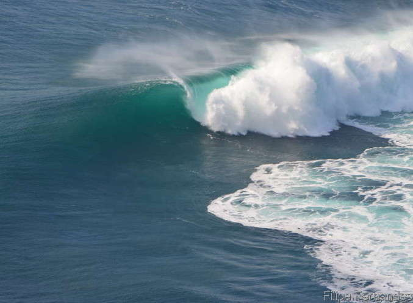

Revisão de conceitos linear vs não-linear

# Definição geral

. . .

Pertubação ao ou distúrbio transmitidos através do
vácuo ou meio gasoso, líquido ou sólido

. . .

*(1) Faça um paralelo, usando tudo que você sobre ondas em geral, entre ondas sonoras, ondas de luz e ondas no mar.*

---

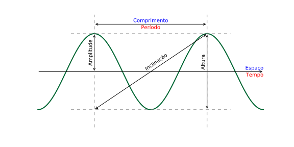

. . .

*(9) Preencha com nomes apropriados as 5 setas indicativas na figura abaixo.*

---

# Equação de onda

- $\eta = \eta_o\cos{(kx - \omega t)}$

- $k = \frac{2\pi}{\lambda}$

- $\omega = \frac{2\pi}{T}$

- $C = \frac{\lambda}{T}$ ou $C = \frac{\omega}{k}$

---

Ondas transportam apenas **energia**...

. . .

... em primeira ordem!

. . .

Isso que dizer que ondas também transportam...

. . .

**massa**!  Mas em segunda ordem.

Revisão de conceitos linear vs não-linear

---

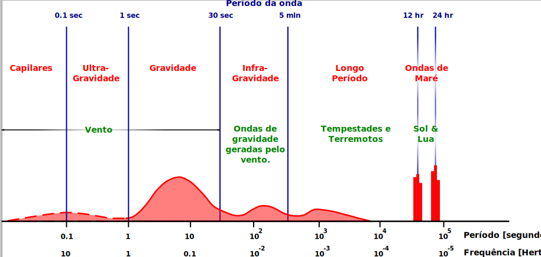

---

## Tipos de onda

> - **Ondas de superfície**:
    - Ocorrem na interface oceano/atmosfera
    - Ondas longas (ou de águas rasas)
    - Ondas curtas (ou de águas profundas)
    - Principal forçante: Vento
    - Força restauradora: Gravidade
    - Importância: **?**
> - **Ondas internas**:
    - Ocorrem interface de densidades da água do mar.
    - Principal forçante: Ondas externas
    - Força restauradora: Gravidade reduzida
    - Importância: **?**

---

## Perguntas:

> - As oscilações são mais facilmente estabelecidas em uma interface interna ou externa (na superfície do mar)?
> - *Resposta: Interna*
> - Quais ondas, de amplitude e comprimento similar, "viajam" mais lentamente: ondas de superfície ou ondas internas?
> - *Resposta: Interna*
> - Quais ondas são mais importantes no contexto de processos de mistura vertical: ondas de superfície ou ondas internas?
> - *Resposta: Interna*

# Ondas internas

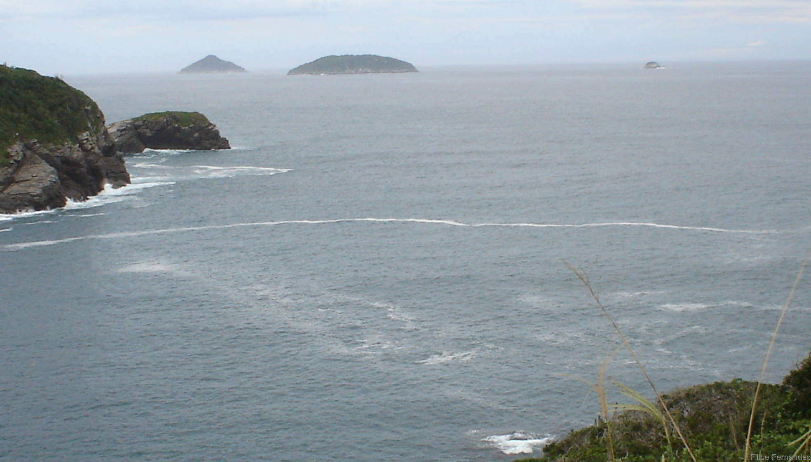

*(8) O que você entende por Onda Interna?*

---

# Ondas externas

Até o final da aula vamos focar nas ondas externa.

. . .

Por que?

---

## Fatores que levam ao desenvolvimento das ondas:

> 1) velocidade do vento
> 2) tempo em que o vento sopra em uma dada velocidade
> 3) pista (*fetch*) em que o vento sopra sobre um mar desobstruído

---

. . .

*(2) Qual é a relação entre ondas no mar e o vento?*

. . .

*(6) Ondas em alto mar (profundidade maior que 1000 metros) é igual a Onda do surfista?  Justifique sua resposta?*

. . .

*(7) O que é "ressaca" no mar?  A onda observada durante uma ressaca é diferente da onda observada normalmente?*

---

## Perguntas:

> - As ondas que vemos todos os dias na praia estão sendo geradas no momento em que as observamos?

# O. de águas profundas...

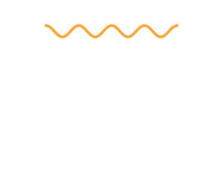

# Ondas de águas rasas...

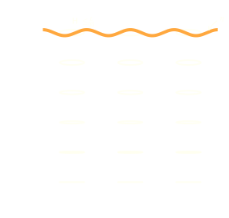

# Ondas de águas profundas vs profundas

> - Ondas de águas profundas $\left(H \geq \frac{\lambda}{2}\right)$
  > - $C = \frac{\lambda}{T}$
  > - $C_g = \frac{C}{2}$
> - Ondas de águas profundas $\left(H \leq \frac{L}{20}\right)$
  > - $C = \sqrt{gH}$
  > - $C_g = C$
> - Ondas de águas intermediárias $\left(H > \frac{L}{20} \text{ e } < \frac{L}{2}\right)$

# Fenômenos

### Quase todos os fenômenos observados na propagação de ondas são resultados das diferenças de velocidades de fase e de grupo entre ondas longas e curtas.  Ou da interação entre ondas.

# Interação de ondas

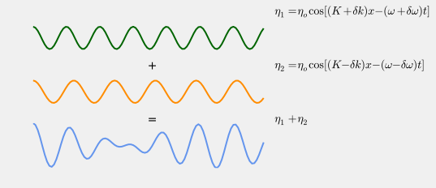

# Ondas estacionárias

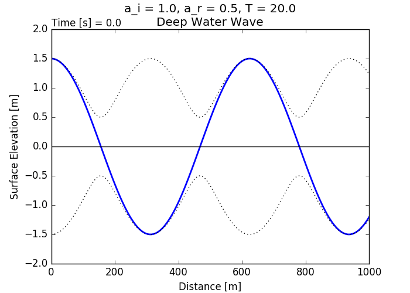

# Dispersão

# Difração e Refração

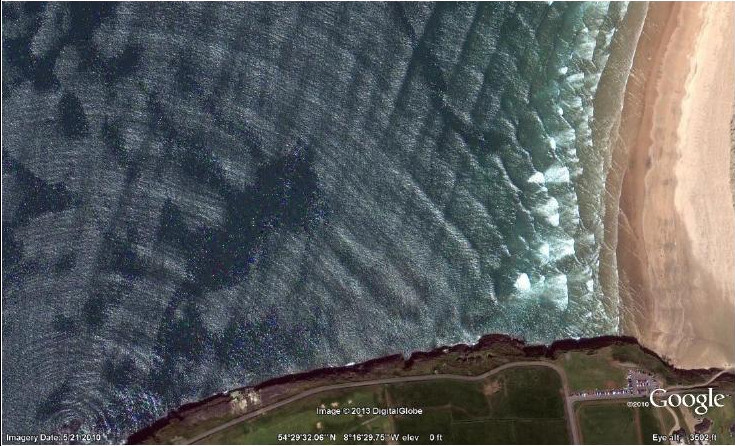

. . .

*(3) Porque as ondas no mar chegam sempre "quase" paralelas à praia?*

# Marés

. . .

*(4) A maré é uma onda?  E o Tsunami é uma onda?  Explique sua resposta.*

. . .

*(5) O que você pode dizer sobre a periodicidade das ondas no mar, das marés e dos Tsunamis?*

# Forças gravitacional + Centrífuga

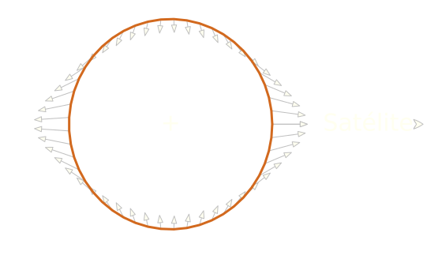

- Maré de equilíbrio (Newton)
- Some da gravidade mais a força centrífuga

# Maré de sizígia (Spring)

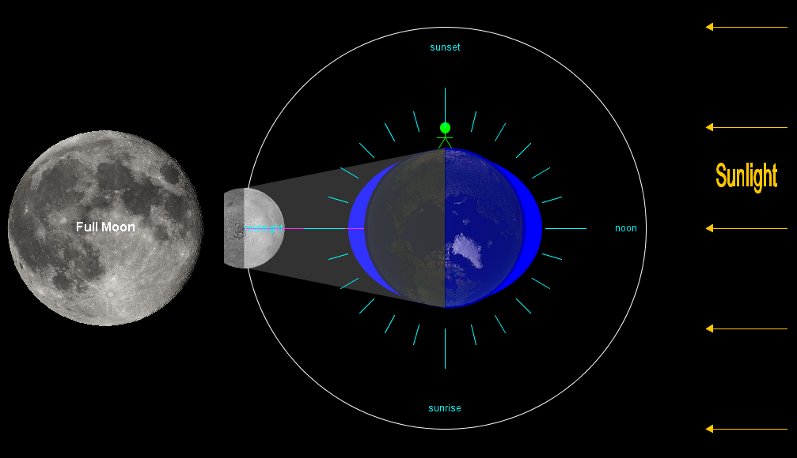

- O efeito to sol é 40% o da Lua

# Maré de sizígia (Spring)

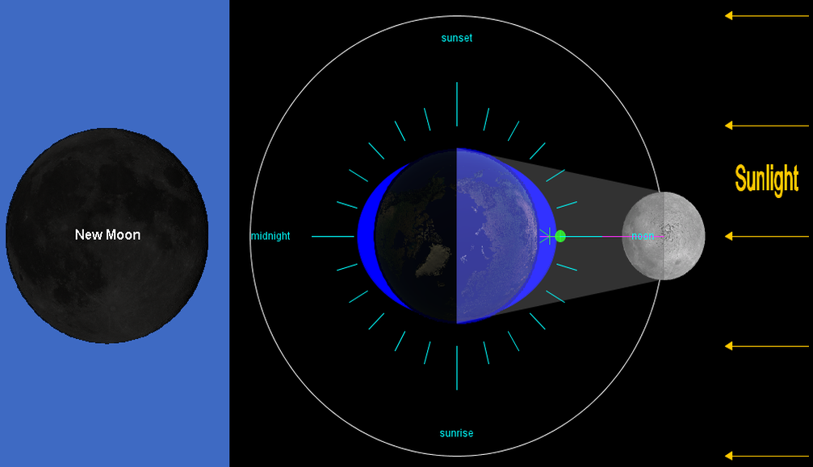

# M. de quadratura (Neap)

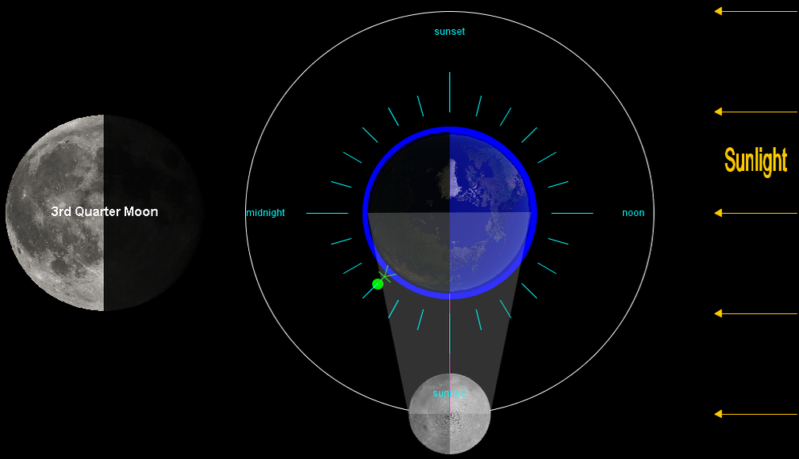

# M. de quadratura (Neap)

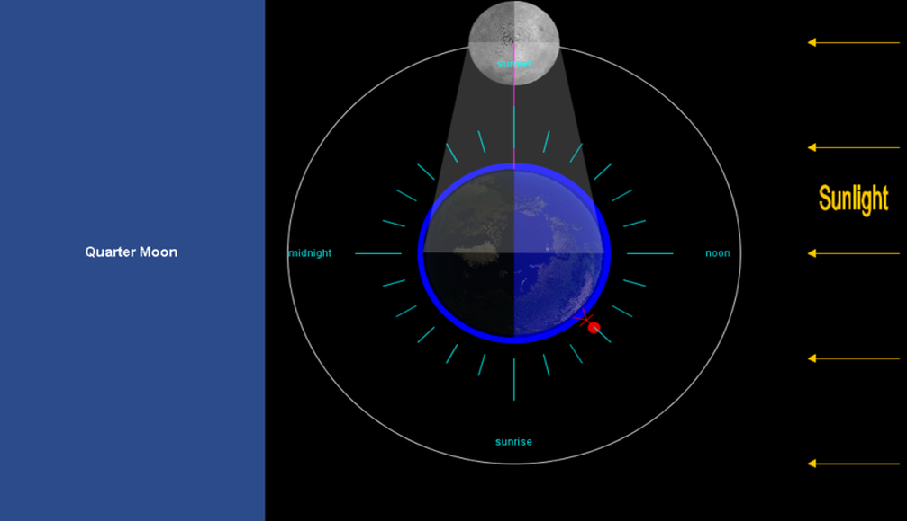

# Registro de Maré

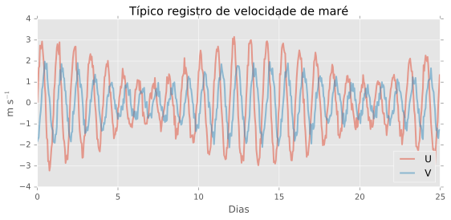

Sistema Lua-Terra gira a cada 27.3 dias

# Componentes de Maré

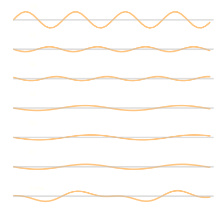

# Componentes

Componente  Tipo         Nome              Período (Horas)
----------  -----------  ---------------   ---------------
**M2**      Semidiurna   Principal Lunar   12.4206
**S2**      Semidiurna   Principal Solar   12.0000
**N2**      Semidiurna   Elíptica Lunar    12.6584
**K2**      Semidiurna   Lunisolar         11.9673
**K1**      Diurna       Lunisolar         23.9344
**O1**      Diurna       Principal Lunar   25.8194
**P1**      Diurna       Principal Solar   24.0659
**Q1**      Diurna       Elíptica Lunar    26.8684
----------  -----------  ---------------   ---------------

# Semidiurna

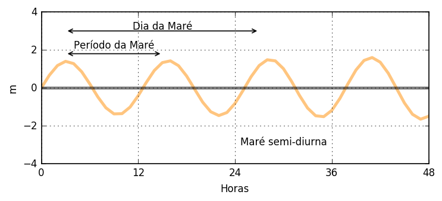

# Diurna

# Mista

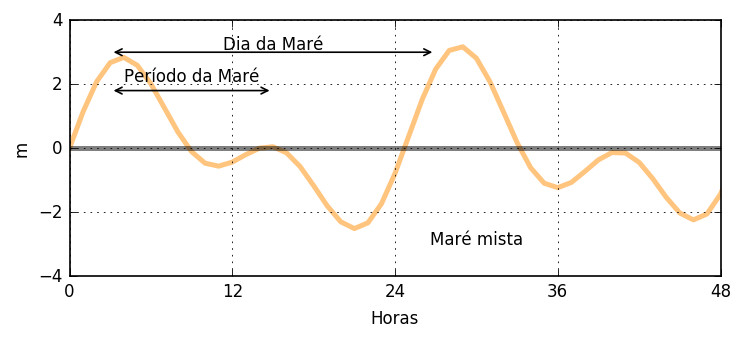

# Mapa global dos tipos de maré

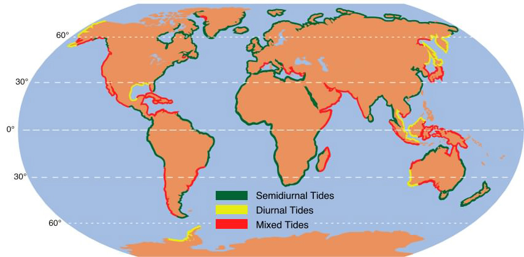

# Contornos e batimetria

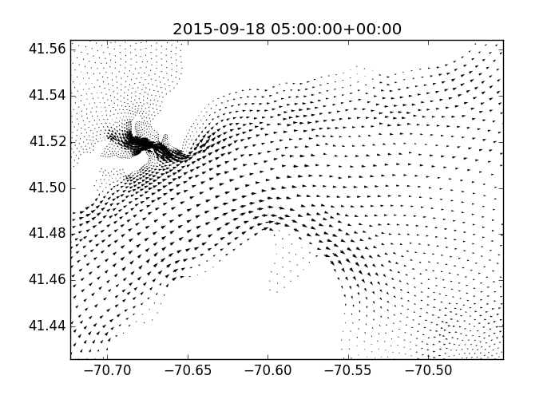

# Maré interna

---

*(10) Marés, se compararmos o mesmo lugar ao longo do tempo (digamos 1-2 meses), podem variar os níveis máximos e mínimos de altura.  Se compararmos lugares diferentes a maré pode mudar sua frequência e suas amplitudes máximas e mínimas.  Quais fatores podem estar relacionados com essa mudança?

# Tsunamis

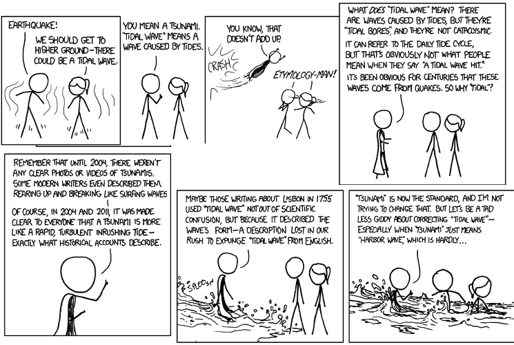
